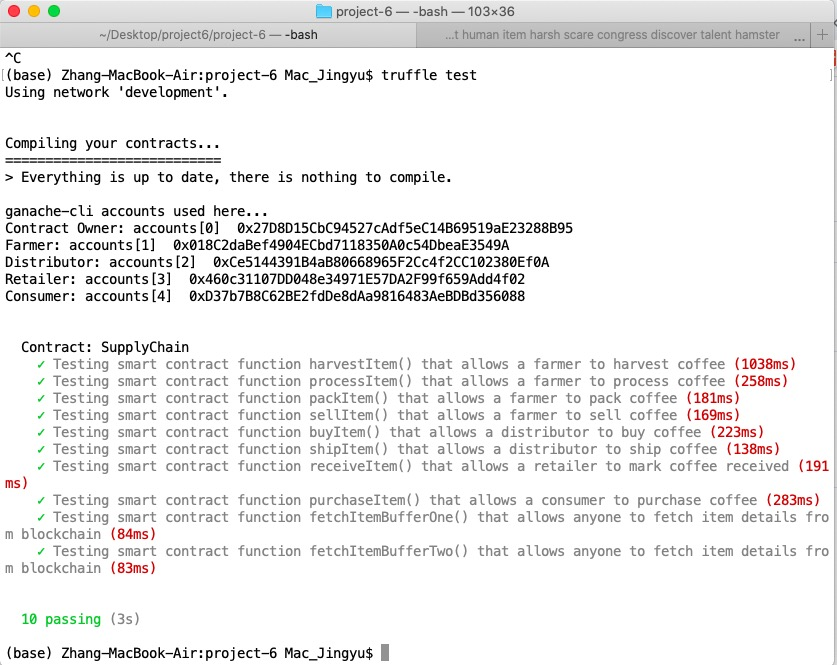

#  Ethereum Dapp for Tracking Items through Supply Chain

This repository containts an Ethereum DApp that demonstrates a Supply Chain flow between a Seller and Buyer. The user story is similar to any commonly used supply chain process. A Seller can add items to the inventory system stored in the blockchain. A Buyer can purchase such items from the inventory system. Additionally a Seller can mark an item as Shipped, and similarly a Buyer can mark an item as Received.

The DApp User Interface when running should look like...


## Diagrams:

### Activity Diagram


### Sequence Diagram


### State Diagram


### Class Diagram


## Rinkeby Deployment Address:

* [FarmerRole address](https://rinkeby.etherscan.io/address/0x26366ca4fd04d1d89d7420f49aa25a85292f57f1)
* [DistributorRole address](https://rinkeby.etherscan.io/address/0x9c6bd1785e7fa4a8cad86026d4333018de6f0dfa)
* [RetailerRole address](https://rinkeby.etherscan.io/address/0xcb14e6c8f2e00a0a902106793fdd507cf4a4d2f2)
* [ConsumerRole address](https://rinkeby.etherscan.io/address/0x9ec18ba716254418fe9781dfbee8bc0ae0803193)
* [SupplyChain address](https://rinkeby.etherscan.io/address/0xb24d9fa278cd877481866a37fe86bc3c8814530d)

## Getting Started

These instructions will get you a copy of the project up and running on your local machine for development and testing purposes. See deployment for notes on how to deploy the project on a live system.

### Prerequisites

Please make sure you've already installed ganache-cli, Truffle and enabled MetaMask extension in your browser.

```
Give examples (to be clarified)
```

### Installing

A step by step series of examples that tell you have to get a development env running

Clone this repository:

```
git clone https://github.com/udacity/nd1309/tree/master/course-5/project-6
```

Change directory to ```project-6``` folder and install all requisite npm packages (as listed in ```package.json```):

```
cd project-6
npm install

```

Launch Ganache:

```
ganache-cli -m "spirit supply whale amount human item harsh scare congress discover talent hamster"
```

Your terminal should look something like this:


In a separate terminal window, Compile smart contracts:

```
truffle compile
```

Your terminal should look something like this:


This will create the smart contract artifacts in folder ```build\contracts```.

Migrate smart contracts to the locally running blockchain, ganache-cli:

```
truffle migrate
```

Your terminal should look something like this:


Test smart contracts:

```
truffle test
```

All 10 tests should pass.



In a separate terminal window, launch the DApp:

```
npm run dev
```

## Built With

* [Ethereum](https://www.ethereum.org/) - Ethereum is a decentralized platform that runs smart contracts
* [IPFS](https://ipfs.io/) - IPFS is the Distributed Web | A peer-to-peer hypermedia protocol
to make the web faster, safer, and more open.
* [Truffle Framework](http://truffleframework.com/) - Truffle is the most popular development framework for Ethereum with a mission to make your life a whole lot easier.


## Authors

See also the list of [contributors](https://github.com/your/project/contributors.md) who participated in this project.

## Acknowledgments

* Solidity
* Ganache-cli
* Truffle
* IPFS
